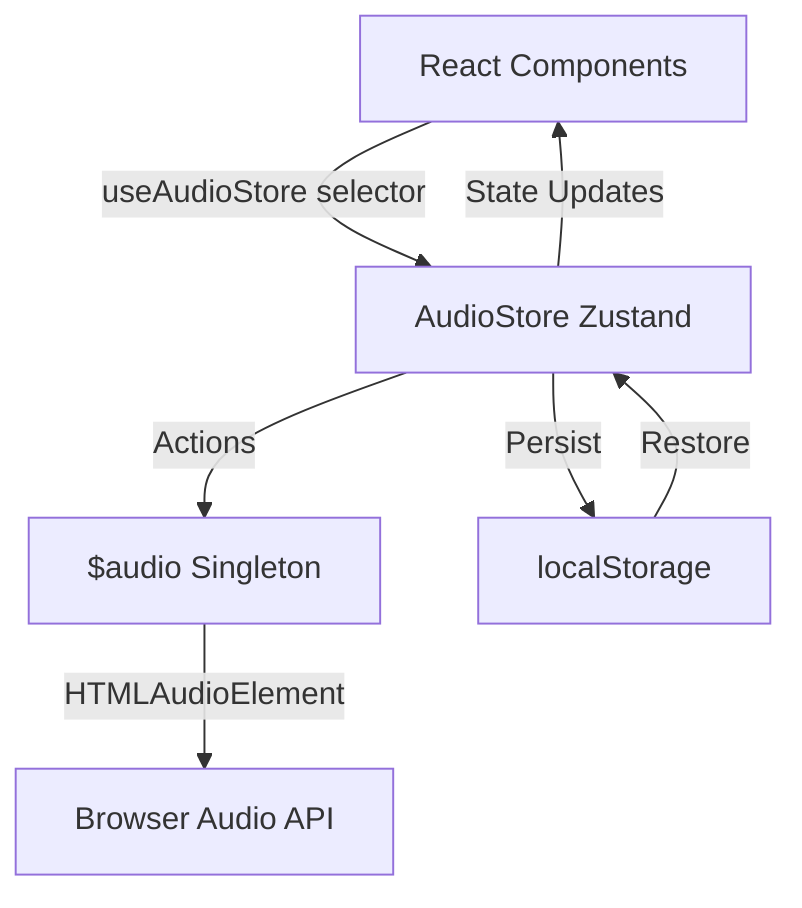
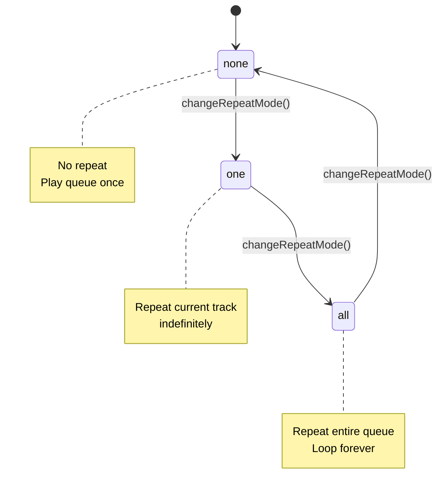

## Installation

### Dependencies

The store uses Zustand. Install it if your app doesn't already include it:

```bash
npm install zustand
```

### Import

Import the store hook and types:

```tsx
import {
  useAudioStore,
  calculateNextIndex,
  calculatePreviousIndex,
  canUseDOM,
  type AudioStore,
  type RepeatMode,
  type InsertMode,
} from "@/lib/audio-store"
```

## Core Concepts

### useAudioStore Hook

<Callout variant="info">
  <strong>Performance Best Practices:</strong> Use granular selectors for better performance. Subscribe only to the specific slices of state you need.
  This prevents unnecessary re-renders when unrelated state changes.
</Callout>

Access the store with granular selectors for better performance:

```tsx
const currentTime = useAudioStore((s) => s.currentTime)
const isPlaying = useAudioStore((s) => s.isPlaying)
```

For multiple values, extract them inside your component:

```tsx
function PlayerStatus() {
  const currentTrack = useAudioStore((s) => s.currentTrack)
  const duration = useAudioStore((s) => s.duration)
  const isPlaying = useAudioStore((s) => s.isPlaying)
  
  return (
    <p>
      {currentTrack?.title} ({duration}s) — {isPlaying ? "▶" : "⏸"}
    </p>
  )
}
```

### Architecture



## Types

### Track

Common audio track object. See [Audio library](/docs/lib/audio#track) for full definition.

### AudioStore State

The store exposes state organized by concern:

| Category | Property | Type | Description |
|----------|----------|------|-------------|
| **Playback** | `isPlaying` | `boolean` | Currently playing |
| | `isLoading` | `boolean` | Loading track |
| | `isBuffering` | `boolean` | Buffering audio |
| | `isError` | `boolean` | Error state |
| | `errorMessage` | `string \| null` | Error details |
| **Current Track** | `currentTrack` | `Track \| null` | Active track object |
| | `currentTime` | `number` | Playback position (seconds) |
| | `duration` | `number` | Track length |
| | `progress` | `number` | Normalized progress 0–1 |
| | `bufferedTime` | `number` | Buffered amount |
| **Queue** | `queue` | `Track[]` | Array of tracks |
| | `history` | `Track[]` | Previously played tracks |
| | `currentQueueIndex` | `number` | Active track index |
| **Controls** | `volume` | `number` | Volume 0–1 |
| | `isMuted` | `boolean` | Mute state |
| | `repeatMode` | `"none" \| "one" \| "all"` | Repeat mode |
| | `shuffleEnabled` | `boolean` | Shuffle state |
| | `insertMode` | `"first" \| "last" \| "after"` | Insertion position for queue |

### Types

| Type | Values | Description |
|------|--------|-------------|
| `RepeatMode` | `"none" \| "one" \| "all"` | Repeat playback mode |
| `InsertMode` | `"first" \| "last" \| "after"` | Where new tracks are added to the queue |

#### RepeatMode Flow



## Utility Functions

### calculateNextIndex(queue, currentIndex, shuffleEnabled, repeatMode)

Calculate the next track index based on playback mode.

```tsx
const nextIndex = calculateNextIndex(
  queue,
  currentQueueIndex,
  shuffleEnabled,
  repeatMode
)
// Returns: number (track index or -1 if none)
```

### calculatePreviousIndex(queue, currentIndex, shuffleEnabled, repeatMode)

Calculate the previous track index based on playback mode.

```tsx
const prevIndex = calculatePreviousIndex(
  queue,
  currentQueueIndex,
  shuffleEnabled,
  repeatMode
)
// Returns: number (track index or -1 if none)
```

### canUseDOM()

Check if code runs in a DOM environment (not SSR).

```tsx
if (canUseDOM()) {
  // Browser-only code
}
```

<Callout variant="warning">
  <strong>SSR Considerations:</strong> The store uses <code>canUseDOM()</code> internally to handle server-side rendering.
  When accessing the store in SSR contexts, ensure you check for DOM availability before calling store methods that interact with browser APIs.
</Callout>

## Actions

Access actions via selectors: `const action = useAudioStore((s) => s.actionName)`

| Category | Action | Signature | Description |
|----------|--------|-----------|-------------|
| **Playback** | `play` | `() => Promise<void>` | Start or resume playback |
| | `pause` | `() => void` | Pause playback |
| | `togglePlay` | `() => void` | Toggle play/pause state |
| | `seek` | `(time: number) => void` | Seek to position (seconds) |
| **Navigation** | `next` | `() => Promise<void>` | Play next track |
| | `previous` | `() => Promise<void>` | Play previous track |
| | `setCurrentTrack` | `(track: Track \| null) => Promise<void>` | Load and play specific track |
| | `setQueueAndPlay` | `(tracks: Track[], startIndex: number) => Promise<void>` | Set queue and play from index |
| **Queue** | `addToQueue` | `(track: Track, mode?: InsertMode) => void` | Add track to queue (supports "first", "last", "after") |
| | `removeFromQueue` | `(trackId: string) => void` | Remove track from queue |
| | `moveInQueue` | `(fromIndex: number, toIndex: number) => void` | Move track in queue |
| | `setQueue` | `(tracks: Track[], startIndex?: number) => void` | Replace entire queue |
| | `clearQueue` | `() => void` | Clear all tracks from queue |
| **Volume** | `setVolume` | `(volume: number) => void` | Set volume (0-1) |
| | `toggleMute` | `() => void` | Toggle mute state |
| **Modes** | `changeRepeatMode` | `() => void` | Cycle repeat mode (none → one → all → none) |
| | `setRepeatMode` | `(mode: RepeatMode) => void` | Set repeat mode |
| | `shuffle` | `() => void` | Randomize queue order |
| | `unshuffle` | `() => void` | Restore original queue order |
| | `setInsertMode` | `(mode: InsertMode) => void` | Set insert mode |
| **Error** | `setError` | `(message: string \| null) => void` | Set or clear error state |

## Examples

### Basic Usage

```tsx
import { useAudioStore } from "@/lib/audio-store"
import { formatDuration } from "@/lib/audio"

function PlayerStatus() {
  // Access state with selectors
  const currentTrack = useAudioStore((s) => s.currentTrack)
  const currentTime = useAudioStore((s) => s.currentTime)
  const duration = useAudioStore((s) => s.duration)
  const isPlaying = useAudioStore((s) => s.isPlaying)
  
  // Access actions
  const togglePlay = useAudioStore((s) => s.togglePlay)
  const next = useAudioStore((s) => s.next)
  const previous = useAudioStore((s) => s.previous)

  return (
    <div>
      <p>Track: {currentTrack?.title ?? "None"}</p>
      <p>Time: {formatDuration(currentTime)} / {formatDuration(duration)}</p>
      <p>Status: {isPlaying ? "▶" : "⏸"}</p>
      <div className="flex gap-2">
        <button onClick={previous}>◀ Prev</button>
        <button onClick={togglePlay}>{isPlaying ? "⏸" : "▶"}</button>
        <button onClick={next}>Next ▶</button>
      </div>
    </div>
  )
}
```

### Queue Management

```tsx
function QueueManager() {
  const queue = useAudioStore((s) => s.queue)
  const addToQueue = useAudioStore((s) => s.addToQueue)
  const removeFromQueue = useAudioStore((s) => s.removeFromQueue)
  const clearQueue = useAudioStore((s) => s.clearQueue)

  return (
    <div>
      <div className="flex gap-2 mb-4">
        <button onClick={() => addToQueue(newTrack, "last")}>Add Track</button>
        <button onClick={clearQueue}>Clear</button>
      </div>
      <div className="space-y-1">
        {queue.map((track) => (
          <div key={track.id} className="flex justify-between">
            <span>{track.title}</span>
            <button onClick={() => removeFromQueue(track.id)}>Remove</button>
          </div>
        ))}
      </div>
    </div>
  )
}
```

### Direct Store Access

```tsx
import { useAudioStore } from "@/lib/audio-store"

// Read state without React subscriptions
const state = useAudioStore.getState()
console.log(state.isPlaying)

// Call actions directly
await useAudioStore.getState().play()

// Subscribe to changes (returns unsubscribe function)
const unsubscribe = useAudioStore.subscribe(
  (s) => s.isPlaying,
  (isPlaying) => console.log("Playing:", isPlaying)
)
```

## Persistence

The store automatically persists a subset of state to localStorage using Zustand's `persist` middleware:

| Category | Properties |
|----------|------------|
| **Playback** | `currentTrack`, `currentTime`, `currentQueueIndex` |
| **Queue** | `queue`, `history` |
| **Settings** | `volume`, `isMuted`, `repeatMode`, `shuffleEnabled`, `insertMode` |

**Storage Key:** `audio:ui:store`

This allows users to resume playback and maintain queue state across page refreshes.

## Related

- [Audio Library](/docs/lib/audio) — Core audio playback singleton
- [Audio Player](/docs/components/player) — Player UI components
- [Audio Queue](/docs/components/queue) — Queue management UI

## Notes

<Callout variant="info">
  <strong>Best Practices:</strong>
  - Prefer selector subscriptions for performance (subscribe to specific slices of state)
  - Async actions (<code>play</code>, <code>next</code>, <code>setCurrentTrack</code>) wait for audio loading
  - <code>addToQueue</code> supports "first", "last", and "after" insert modes
  - Queue shuffling randomizes order but preserves track identity
  - <code>setQueueAndPlay</code> and similar actions trigger audio loading via the [Audio library](/docs/lib/audio)
  - Persistence is automatic; no manual save required
  - Direct store access via <code>getState()</code> is useful for non-React code or imperative operations
</Callout>
