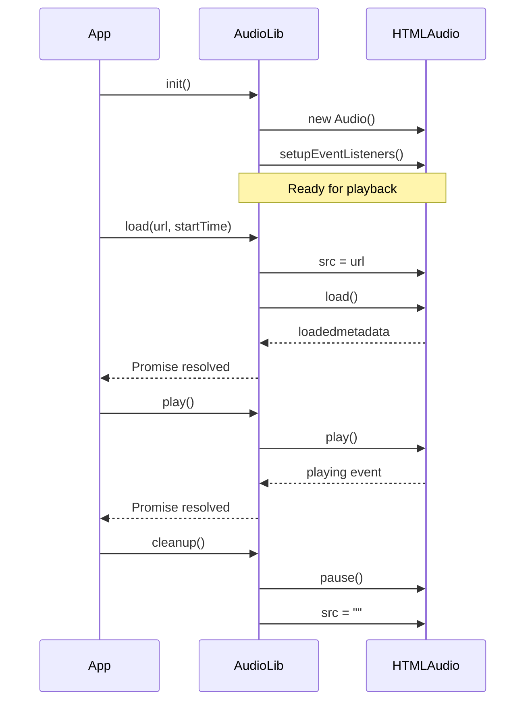

The `$audio` singleton manages playback of HTML5 audio with automatic retry logic, event handling, and volume fading. Use it alongside the [Audio Store](/docs/lib/audio-store) for full player functionality.

## Installation

<CodeTabs>
  <TabsList>
    <TabsTrigger value="cli">CLI</TabsTrigger>
    <TabsTrigger value="manual">Manual</TabsTrigger>
  </TabsList>
  <TabsContent value="cli">

  ```bash
  npx shadcn@latest add @audio/lib
  ```

  </TabsContent>

  <TabsContent value="manual">

    <Steps>
      <Step>Copy and paste the following code into your project.</Step>
        <Source name="lib" title="lib/audio.ts" />
      <Step>Update the import paths to match your project setup.</Step>
    </Steps>

  </TabsContent>
</CodeTabs>

### Import

Import the singleton and helpers from the audio library:

```tsx
import { $audio, formatDuration, isLive, type Track } from "@/lib/audio";
```

## Core API

### $audio (Singleton)

Manages the underlying `HTMLAudioElement`, playback state, retries, and events. Initialize on client start — the instance is server-safe.

```tsx
import { $audio } from "@/lib/audio";

// Initialize on the client
$audio.init();

// Load and play
await $audio.load("https://example.com/audio.mp3", 0);
await $audio.play();
```

<Callout variant="info">
  <strong>Client initialization:</strong> The <code>$audio</code> singleton must
  be initialized on the client. Call <code>$audio.init()</code> from a client
  component or inside <code>useEffect()</code> so the underlying{" "}
  <code>HTMLAudioElement</code> is created only in the browser environment.
</Callout>

#### Lifecycle

| Method      | Description                                             |
| ----------- | ------------------------------------------------------- |
| `init()`    | Initialize on the client. Safe to call multiple times.  |
| `cleanup()` | Reset and release the audio element (pause, clear src). |



#### Playback

| Method                           | Description                                                                                                                     |
| -------------------------------- | ------------------------------------------------------------------------------------------------------------------------------- |
| `load(url, startTime?, isLive?)` | Load an audio source and wait for readiness. Pass `isLive` for live streams (longer timeout, no seek). Returns `Promise<void>`. |
| `play()`                         | Start or resume playback. Returns promise that resolves when browser allows playback.                                           |
| `pause()`                        | Pause playback immediately.                                                                                                     |
| `seek(time)`                     | Seek when metadata is available. Ignored for live streams.                                                                      |

<Callout variant="warning">
  <strong>Browser autoplay restrictions:</strong> The <code>play()</code> call
  returns a promise which may be rejected by browser autoplay policies if there
  was no user gesture. Wrap calls to <code>play()</code> in a try/catch and
  provide a fallback UI so your app handles playback interruptions gracefully.
</Callout>

<Callout variant="info">
  <strong>Live streams:</strong> For live streams (when <code>isLive</code> is
  true) seeking is disabled and long timeouts are used. Live streams are best
  handled with a separate code-path because the playback semantics differ from
  on-demand audio files.
</Callout>

#### Volume

| Method                         | Description                                                     |
| ------------------------------ | --------------------------------------------------------------- |
| `setVolume(volume, fadeTime?)` | Set or fade volume (0–1). If `fadeTime` > 0, animates smoothly. |
| `getVolume()`                  | Return current volume (0–1).                                    |
| `setMuted(muted)`              | Mute or unmute. Restores previous volume when unmuting.         |

#### State

| Method                | Description                                                    |
| --------------------- | -------------------------------------------------------------- |
| `getDuration()`       | Return loaded source duration (seconds) or `0` if unavailable. |
| `getCurrentTime()`    | Return current playback position (seconds).                    |
| `isPaused()`          | Return boolean — is playback paused.                           |
| `getBufferedRanges()` | Return underlying `TimeRanges` or `null`.                      |
| `getSource()`         | Return current source URL string.                              |
| `getAudioElement()`   | Return raw `HTMLAudioElement` or `null` on server.             |

#### Events

The library emits custom events via an internal `EventTarget`:

```tsx
$audio.addEventListener("bufferingStart", () => console.log("Buffering..."));
$audio.addEventListener("bufferingEnd", () => console.log("Ready to play"));
$audio.addEventListener("playbackStarted", () => console.log("Playing"));
$audio.addEventListener("audioError", () => console.error("Error"));
$audio.addEventListener("bufferUpdate", (e) => {
  if (e instanceof CustomEvent) console.log("Buffered:", e.detail.bufferedTime);
});
```

## Utilities

### formatDuration(seconds)

Format seconds to `MM:SS` string. Handles invalid input by returning `"0:00"`.

```tsx
import { formatDuration } from "@/lib/audio";

formatDuration(125); // "2:05"
formatDuration(3661); // "61:01"
```

### isLive(track)

Heuristic check for live streams based on URL patterns or `track.live` flag.

```tsx
import { isLive } from "@/lib/audio";

if (isLive(track)) {
  // Handle live stream (no seeking)
}
```

## Types

### Track

Common audio track object with optional fields:

| Prop            | Type               | Default | Description                      |
| --------------- | ------------------ | ------- | -------------------------------- |
| `id`            | `string \| number` | -       | Unique identifier for the track. |
| `url`           | `string`           | -       | URL of the audio file or stream. |
| `title`         | `string`           | -       | Track title.                     |
| `artist`        | `string`           | -       | Artist name.                     |
| `artwork`       | `string`           | -       | Album artwork URL.               |
| `images`        | `string[]`         | -       | Array of image URLs.             |
| `duration`      | `number`           | -       | Track duration in seconds.       |
| `album`         | `string`           | -       | Album name.                      |
| `genre`         | `string`           | -       | Genre.                           |
| `live`          | `boolean`          | -       | Whether this is a live stream.   |
| `[key: string]` | `unknown`          | -       | Additional properties.           |

## Examples

### Basic Playback

```tsx
import { $audio } from "@/lib/audio";

$audio.init();

async function playTrack(url: string) {
  try {
    await $audio.load(url, 0);
    await $audio.play();
  } catch (error) {
    console.error("Playback failed:", error);
  }
}
```

### Volume Management

```tsx
import { $audio } from "@/lib/audio";

// Immediate change
$audio.setVolume(0.5);

// Smooth fade over 1 second
$audio.setVolume(0.8, 1000);

// Mute with memory
$audio.setMuted(true);
$audio.setMuted(false); // Restores previous volume
```

### React Component

```tsx
import { $audio, formatDuration } from "@/lib/audio";
import { useEffect, useState } from "react";

function TimeDisplay() {
  const [time, setTime] = useState(0);

  useEffect(() => {
    const updateTime = () => setTime($audio.getCurrentTime());
    const interval = setInterval(updateTime, 100);
    return () => clearInterval(interval);
  }, []);

  return <span>{formatDuration(time)}</span>;
}
```

### Event Monitoring

```tsx
import { $audio } from "@/lib/audio";

$audio.addEventListener("bufferingStart", () => {
  console.log("Loading audio...");
});

$audio.addEventListener("bufferingEnd", () => {
  console.log("Ready to play");
});

$audio.addEventListener("audioError", (event) => {
  console.error("Audio error:", event);
});
```

## Related

- [Audio Store](/docs/lib/audio-store) — Zustand store for queue and playback state management
- [Audio Player](/docs/components/player) — Composable player UI components

## Notes

- Singleton pattern: All methods access the same `$audio` instance
- Server-safe: Methods check for client-side availability before executing
- Automatic retries: Handles load/play errors with exponential backoff (max 3 attempts)
- Volume fading: Animations use `requestAnimationFrame` for smooth transitions
- Live streams: Disable seeking and use extended timeout for reliability
- `formatDuration` handles edge cases (NaN, Infinity, negative values)

## Changelog

### 2025-12-02 Live stream playback rate protection

- **Added**: `setPlaybackRate()` now prevents rate changes for live streams
- **Fixed**: `LIVE_STREAM_PATTERNS` moved to top-level scope for better performance
- **Improved**: Live stream detection uses consistent patterns across the library
